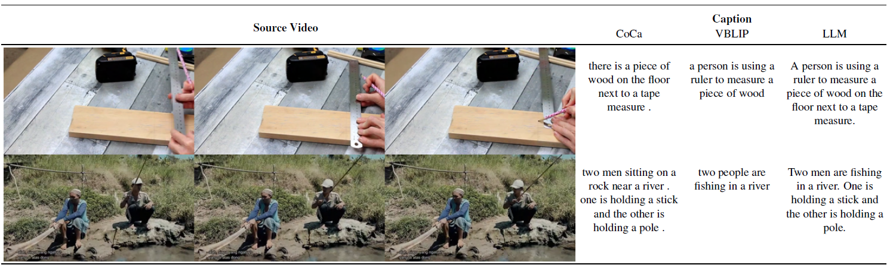

# Video Captioner: Create captions for your video dataset

<br>

_Implementing the way [Stable Video Diffusion](https://static1.squarespace.com/static/6213c340453c3f502425776e/t/655ce779b9d47d342a93c890/1700587395994/stable_video_diffusion.pdf) (SVD) creates captions for videos._
In this project, in the first step an image-to-text model ([CoCa](https://github.com/mlfoundations/open_clip/tree/main)) is used to create captions for the middle frame of each video. Another video-to-text model ([VideoBLIP](https://github.com/yukw777/VideoBLIP/tree/main)) is used to create captions for the whole video. Then, the captions are combined using an LLM to create a caption for the whole video.

**Nov 28, 2023**
* First release of the project.

<br>



## Some results

| Source Video| Coca | VideoBLIP | LLM |
|:-------------------------------:|:--------------------------------------------------:| :--------------------------------------------------:| :--------------------------------------------------:|
| | a person is cooking pasta in a pan on a table | a person holding a frying pan over a bowl of food | A person is cooking pasta in a pan on a table, while holding a frying pan over a bowl of food. |
| | a person cutting up carrots on top of a table | a person cutting vegetables on a cutting board | A person is cutting vegetables, including carrots, on a cutting board placed on top of a table. |
| | a view from a motorcycle as it rides down the street | a person riding a motorcycle on a city street at sunset | A person is riding a motorcycle on a city street at sunset, experiencing a unique view from the motorcycle as it rides down the street. |

You can also find more results in the _data/captions.csv_ folder.


## Dependency installation

The code was successfully built and run with these versions:

```
torch==2.1.1+cu118
torchvision==0.16.1+cu118
open_clip_torch==2.23.0
transformers==4.35.2
pytorchvideo==0.1.5
pandas==2.1.3
bitsandbytes==0.41.2.post2
scipy==1.11.4
opencv-python==4.8.1.78

```
Note: You can also create the environment I've tested with by importing _environment.yml_ to conda.

## Usage

### 1. Download the dataset
### 2. Extract video and image captions

```python
python video_captioner.py --video_root <path_to_dataset>
```
This will extract the video and image captions and save them in a csv file.

### 3. Combine captions

```python
python LLM_mixer.py --csv_path <path_to_csv_created_in_step_2>
```
Note: You can tweak the __message__ variable in _LLM_mixer.py_ to change the steer of the LLM output.

## Reference 
If you found this repo useful give me a star!